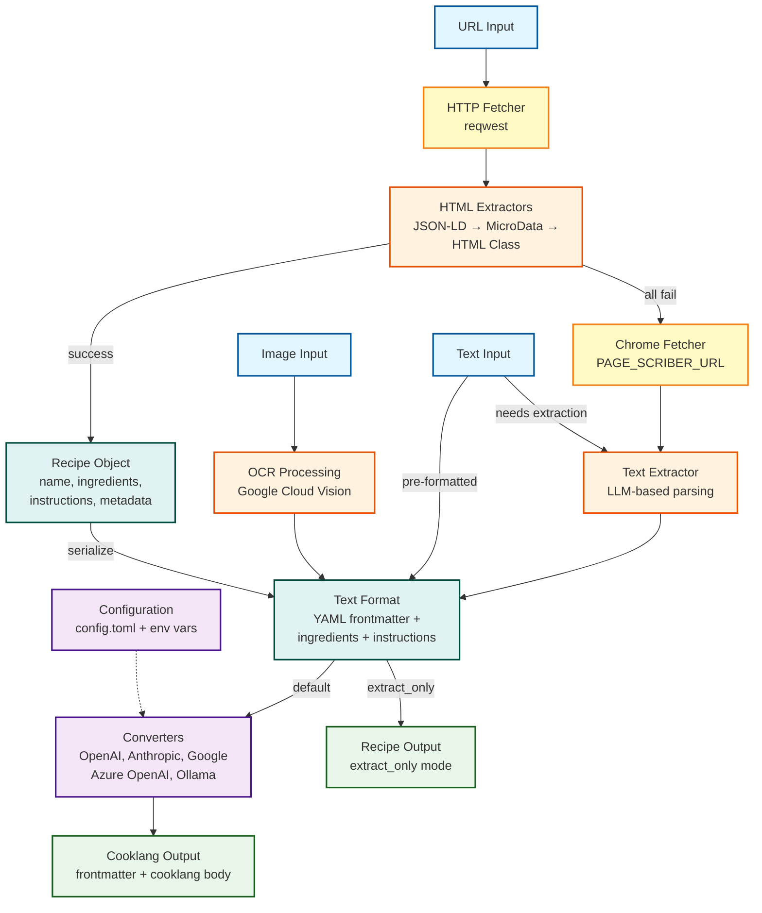

# Architecture Overview

This document provides a high-level overview of the cooklang-import system architecture, showing the different input flows and their outcomes.

## System Architecture



## Project Structure

```
src/
├── lib.rs                      # Public API exports
├── main.rs                     # CLI binary
├── model.rs                    # Recipe struct with serialization
├── builder.rs                  # Builder API + pipeline orchestration
├── config.rs                   # Configuration loading
├── error.rs                    # Error types
│
├── pipelines/                  # Flow orchestration
│   ├── mod.rs
│   ├── url.rs                  # URL → text pipeline
│   ├── text.rs                 # Text → text pipeline
│   └── image.rs                # Image → text pipeline
│
├── url_to_text/                # URL input processing
│   ├── mod.rs
│   ├── fetchers/
│   │   ├── mod.rs
│   │   ├── request.rs          # HTTP fetch (reqwest)
│   │   └── chrome.rs           # Chrome/Puppeteer fetch
│   ├── html/
│   │   ├── mod.rs
│   │   └── extractors/
│   │       ├── mod.rs          # Extractor trait + ParsingContext
│   │       ├── json_ld.rs      # JSON-LD schema extraction
│   │       ├── microdata.rs    # HTML5 microdata extraction
│   │       └── html_class.rs   # CSS class-based extraction
│   └── text/
│       ├── mod.rs
│       └── extractor.rs        # LLM-based plain text extraction
│
├── images_to_text/             # Image input processing
│   ├── mod.rs
│   └── ocr.rs                  # Google Vision OCR (path + base64)
│
└── converters/                 # Text → Cooklang conversion
    ├── mod.rs                  # Converter trait + factory
    ├── prompt.rs               # Cooklang conversion prompt
    ├── prompt.txt              # Prompt template
    ├── open_ai.rs
    ├── anthropic.rs
    ├── azure_openai.rs
    ├── google.rs
    └── ollama.rs
```

## Input Flows

### 1. URL → Recipe/Cooklang
The most common use case where a recipe URL is provided:
- **Fetchers**: Try HTTP request first, fall back to Chrome if needed
- **Extractors**: Try JSON-LD → MicroData → HTML Class in order
- **Fallback**: If all extractors fail, use plain text LLM extraction
- **Output**: Recipe struct (extract_only) or Cooklang format (default)

### 2. Text → Cooklang
For plain text or pre-formatted recipes:
- **Pre-formatted**: Assumes text is already in correct format (frontmatter + ingredients + instructions)
- **With extraction**: Uses LLM to parse unstructured text into structured format
- **Output**: Cooklang format via converter

### 3. Image → Cooklang
For recipe images (photos, screenshots):
- Uses Google Cloud Vision API for OCR
- Supports file paths or base64-encoded images
- Multiple images can be combined
- **Output**: Cooklang format via converter

## Data Flow

```
Input → Pipeline → Intermediate Format → Converter → Output

Intermediate Format (Text with YAML frontmatter):
---
title: Recipe Name
source: https://example.com
author: Chef Name
servings: 4
---

ingredient 1
ingredient 2
ingredient 3

Instructions text here...
```

## Processing Components

### Fetchers (url_to_text/fetchers/)
- **RequestFetcher**: Standard HTTP fetch using reqwest with timeout and user agent
- **ChromeFetcher**: Headless browser fetch via PAGE_SCRIBER_URL for JS-heavy pages

### HTML Extractors (url_to_text/html/extractors/)
Attempt extraction in order of reliability:
1. **JSON-LD**: Structured recipe data in `<script type="application/ld+json">`
2. **MicroData**: HTML5 microdata attributes (itemscope, itemprop)
3. **HTML Class**: Common CSS class patterns for recipe sites

### Text Extractor (url_to_text/text/)
LLM-based extraction for plain text when structured extractors fail.

### Converters (converters/)
Transform intermediate text format to Cooklang:
- **Trait**: `Converter` with `convert(text) -> Result<String>`
- **Factory**: `create_converter(name, config)` for dynamic creation
- **Providers**: OpenAI, Anthropic, Google, Azure OpenAI, Ollama

## Configuration

Configuration is loaded from multiple sources (in priority order):
1. Environment variables (e.g., `OPENAI_API_KEY`)
2. `config.toml` file
3. Default values

### Configurable Options
- **Extractors**: Enable/disable and order of extraction strategies
- **Converters**: Enable/disable providers, set default, configure fallback order
- **Timeouts**: HTTP request timeouts

```toml
[extractors]
enabled = ["json_ld", "microdata", "html_class"]
order = ["json_ld", "microdata", "html_class"]

[converters]
enabled = ["anthropic", "open_ai", "ollama"]
order = ["anthropic", "open_ai", "ollama"]
default = "anthropic"

[providers.anthropic]
enabled = true
model = "claude-3-5-sonnet-20241022"
```

## Output Modes

### Recipe Struct (extract_only)
Returns structured recipe data without LLM conversion:
- Title in YAML frontmatter
- Ingredients (one per line)
- Instructions (free text)
- Metadata (cook time, servings, source, etc.)

### Cooklang Format (default)
Converts recipe to Cooklang syntax:
- YAML frontmatter with metadata
- Ingredients marked with `@ingredient{quantity%unit}` syntax
- Cookware marked with `#cookware{}` syntax
- Timers marked with `~{time%unit}` syntax
