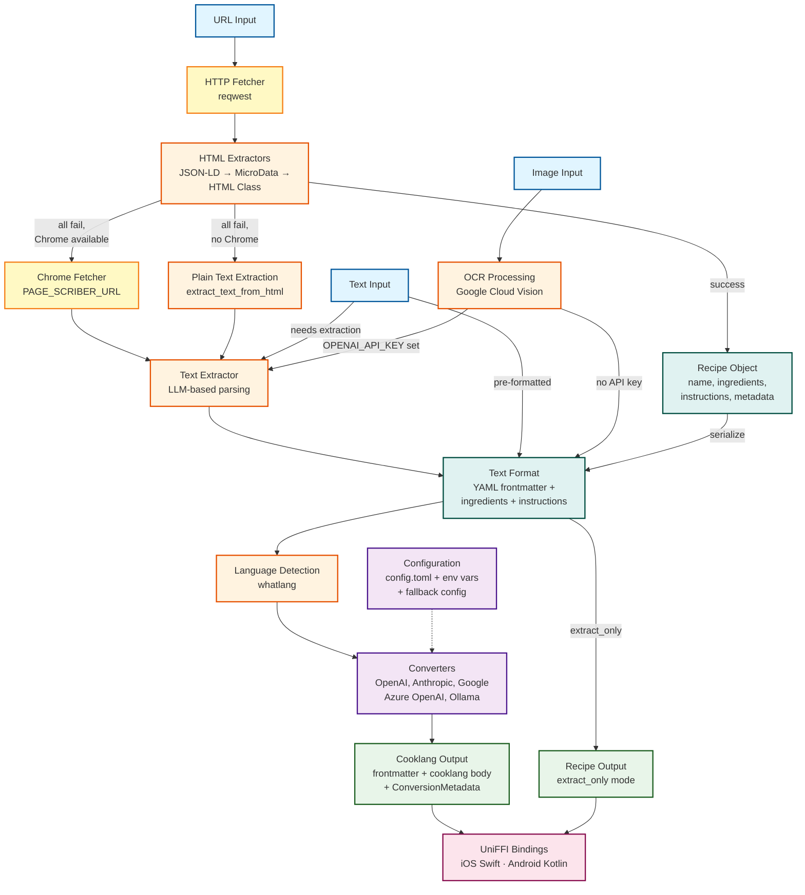

# Architecture Overview

This document provides a high-level overview of the cooklang-import system architecture, showing the different input flows and their outcomes.

## System Architecture


```mermaid
flowchart TB
    %% Input Sources
    URL[URL Input]
    TEXT[Text Input]
    IMAGE[Image Input]

    %% Fetchers
    FETCH_REQ[HTTP Fetcher<br/>reqwest]
    FETCH_CHROME[Chrome Fetcher<br/>PAGE_SCRIBER_URL]

    %% Processing Stages
    EXTRACT_HTML[HTML Extractors<br/>JSON-LD → MicroData →<br/>HTML Class]
    EXTRACT_PLAIN[Plain Text Extraction<br/>extract_text_from_html]
    EXTRACT_TEXT[Text Extractor<br/>LLM-based parsing]
    LANG_DETECT[Language Detection<br/>whatlang]
    OCR[OCR Processing<br/>Google Cloud Vision]

    %% Intermediate State
    RECIPE[Recipe Object<br/>name, ingredients,<br/>instructions, metadata]
    TEXT_FORMAT[Text Format<br/>YAML frontmatter +<br/>ingredients + instructions]

    %% Configuration
    CONFIG[Configuration<br/>config.toml + env vars<br/>+ fallback config]

    %% LLM Conversion
    CONVERTERS[Converters<br/>OpenAI, Anthropic, Google<br/>Azure OpenAI, Ollama]

    %% Output Modes
    RECIPE_OUT[Recipe Output<br/>extract_only mode]
    COOKLANG_OUT[Cooklang Output<br/>frontmatter + cooklang body<br/>+ ConversionMetadata]

    %% FFI Layer
    FFI[UniFFI Bindings<br/>iOS Swift · Android Kotlin]

    %% Flow connections
    URL --> FETCH_REQ
    FETCH_REQ --> EXTRACT_HTML
    EXTRACT_HTML --> |success| RECIPE
    EXTRACT_HTML --> |all fail,<br/>Chrome available| FETCH_CHROME
    EXTRACT_HTML --> |all fail,<br/>no Chrome| EXTRACT_PLAIN
    FETCH_CHROME --> EXTRACT_TEXT
    EXTRACT_PLAIN --> EXTRACT_TEXT
    EXTRACT_TEXT --> TEXT_FORMAT

    TEXT --> |pre-formatted| TEXT_FORMAT
    TEXT --> |needs extraction| EXTRACT_TEXT

    IMAGE --> OCR
    OCR --> |OPENAI_API_KEY set| EXTRACT_TEXT
    OCR --> |no API key| TEXT_FORMAT

    RECIPE --> |serialize| TEXT_FORMAT

    TEXT_FORMAT --> |extract_only| RECIPE_OUT
    TEXT_FORMAT --> LANG_DETECT
    LANG_DETECT --> CONVERTERS

    CONFIG -.-> CONVERTERS

    CONVERTERS --> COOKLANG_OUT

    COOKLANG_OUT --> FFI
    RECIPE_OUT --> FFI

    %% Styling
    classDef inputStyle fill:#e1f5ff,stroke:#01579b,stroke-width:2px
    classDef fetchStyle fill:#fff9c4,stroke:#f57f17,stroke-width:2px
    classDef processStyle fill:#fff3e0,stroke:#e65100,stroke-width:2px
    classDef dataStyle fill:#e0f2f1,stroke:#004d40,stroke-width:2px
    classDef outputStyle fill:#e8f5e9,stroke:#1b5e20,stroke-width:2px
    classDef configStyle fill:#f3e5f5,stroke:#4a148c,stroke-width:2px
    classDef ffiStyle fill:#fce4ec,stroke:#880e4f,stroke-width:2px

    class URL,TEXT,IMAGE inputStyle
    class FETCH_REQ,FETCH_CHROME fetchStyle
    class EXTRACT_HTML,EXTRACT_PLAIN,EXTRACT_TEXT,LANG_DETECT,OCR processStyle
    class RECIPE,TEXT_FORMAT dataStyle
    class RECIPE_OUT,COOKLANG_OUT outputStyle
    class CONFIG,CONVERTERS configStyle
    class FFI ffiStyle
```

## Project Structure

```
src/
├── lib.rs                      # Public API exports
├── main.rs                     # CLI binary
├── model.rs                    # Recipe struct with serialization
├── builder.rs                  # Builder API + pipeline orchestration
├── config.rs                   # Configuration loading (+ FallbackConfig)
├── error.rs                    # Error types
├── uniffi_bindings.rs          # FFI bindings for iOS/Android (feature-gated)
│
├── pipelines/                  # Flow orchestration
│   ├── mod.rs
│   ├── url.rs                  # URL → text pipeline
│   ├── text.rs                 # Text → text pipeline
│   └── image.rs                # Image → text pipeline
│
├── url_to_text/                # URL input processing
│   ├── mod.rs
│   ├── fetchers/
│   │   ├── mod.rs
│   │   ├── request.rs          # HTTP fetch (reqwest)
│   │   └── chrome.rs           # Chrome/Puppeteer fetch
│   ├── html/
│   │   ├── mod.rs
│   │   └── extractors/
│   │       ├── mod.rs          # Extractor trait + ParsingContext
│   │       ├── json_ld.rs      # JSON-LD schema extraction
│   │       ├── microdata.rs    # HTML5 microdata extraction
│   │       └── html_class.rs   # CSS class-based extraction
│   └── text/
│       ├── mod.rs
│       └── extractor.rs        # LLM-based plain text extraction
│
├── images_to_text/             # Image input processing
│   ├── mod.rs
│   └── ocr.rs                  # Google Vision OCR (path + base64)
│
└── converters/                 # Text → Cooklang conversion
    ├── mod.rs                  # Converter trait + factory + TokenUsage/ConversionMetadata
    ├── prompt.rs               # Cooklang conversion prompt + language detection (whatlang)
    ├── prompt.txt              # Prompt template ({{RECIPE}} + {{LANGUAGE}})
    ├── open_ai.rs
    ├── anthropic.rs
    ├── azure_openai.rs
    ├── google.rs
    └── ollama.rs

build.rs                        # Cargo build script (UniFFI scaffolding)
uniffi.toml                     # UniFFI binding generation config
uniffi-bindgen.rs               # UniFFI CLI entry point
Package.swift                   # Swift Package Manager manifest
scripts/
├── build-android.sh
├── build-ios.sh
├── generate-swift-package.sh
├── publish-android.sh
└── test-ios-release.sh
```

## Input Flows

### 1. URL → Recipe/Cooklang
The most common use case where a recipe URL is provided:
- **Step 1**: Fetch HTML via HTTP request (reqwest)
- **Step 2**: Try HTML extractors in order: JSON-LD → MicroData → HTML Class
- **Step 3a**: If all extractors fail and `PAGE_SCRIBER_URL` is set, re-fetch via Chrome then use LLM-based Text Extractor
- **Step 3b**: If all extractors fail and Chrome is unavailable, extract plain text from already-fetched HTML (`extract_text_from_html`) then use Text Extractor
- **Output**: Recipe struct (extract_only) or Cooklang format (default)

### 2. Text → Cooklang
For plain text or pre-formatted recipes:
- **Pre-formatted**: Assumes text is already in correct format (frontmatter + ingredients + instructions)
- **With extraction**: Uses LLM to parse unstructured text into structured format
- **Output**: Cooklang format via converter

### 3. Image → Cooklang
For recipe images (photos, screenshots):
- Uses Google Cloud Vision API for OCR
- Supports file paths or base64-encoded images
- Multiple images can be combined
- **Structured extraction**: If `OPENAI_API_KEY` is set, OCR text goes through TextExtractor to extract title, metadata (servings, prep_time, cook_time, total_time), and structured recipe text
- **Fallback**: If no API key, returns raw OCR text
- **Output**: Cooklang format via converter

## Data Flow

```
Input → Pipeline → Intermediate Format → Converter → Output

Intermediate Format (Text with YAML frontmatter):
---
title: Recipe Name
source: https://example.com
servings: 4
prep_time: 15 min
cook_time: 30 min
total_time: 45 min
---

ingredient 1
ingredient 2
ingredient 3

Instructions text here...
```

## Processing Components

### Fetchers (url_to_text/fetchers/)
- **RequestFetcher**: Standard HTTP fetch using reqwest with timeout and user agent
- **ChromeFetcher**: Headless browser fetch via PAGE_SCRIBER_URL for JS-heavy pages

### HTML Extractors (url_to_text/html/extractors/)
Attempt extraction in order of reliability:
1. **JSON-LD**: Structured recipe data in `<script type="application/ld+json">`
2. **MicroData**: HTML5 microdata attributes (itemscope, itemprop)
3. **HTML Class**: Common CSS class patterns for recipe sites

### Text Extractor (url_to_text/text/)
LLM-based extraction that parses unstructured text into structured recipe components:
- Extracts title, servings, prep_time, cook_time, total_time
- Parses ingredients and instructions from messy text
- Used as fallback for URL processing when HTML extractors fail
- Used for image OCR output to extract structured data from raw OCR text
- Requires `OPENAI_API_KEY` environment variable

### Converters (converters/)
Transform intermediate text format to Cooklang:
- **Trait**: `Converter` with `convert(text) -> Result<String>`
- **Factory**: `create_converter(name, config)` for dynamic creation
- **Providers**: OpenAI, Anthropic, Google, Azure OpenAI, Ollama
- **Language detection**: Uses `whatlang` crate to auto-detect recipe language, injected into prompt template as `{{LANGUAGE}}`
- **Metadata**: Returns `ConversionMetadata` with `model_version`, `TokenUsage` (input/output tokens), and `latency_ms`
- **Fallback**: Configurable provider fallback with retry attempts and exponential backoff (`FallbackConfig`)

## Configuration

Configuration is loaded from multiple sources (in priority order):
1. Environment variables (e.g., `OPENAI_API_KEY`)
2. `config.toml` file
3. Default values

### Configurable Options
- **Extractors**: Enable/disable and order of extraction strategies
- **Converters**: Enable/disable providers, set default, configure fallback order
- **Fallback**: Enable/disable automatic provider failover with retry attempts and delay
- **Timeouts**: HTTP request timeouts
- **Provider-specific**: API keys, base URLs, endpoints, model names, project IDs (Google), deployment names (Azure)

```toml
[extractors]
enabled = ["json_ld", "microdata", "html_class"]
order = ["json_ld", "microdata", "html_class"]

[converters]
enabled = ["anthropic", "open_ai", "ollama"]
order = ["anthropic", "open_ai", "ollama"]
default = "anthropic"

[converters.fallback]
enabled = true
order = ["anthropic", "open_ai", "ollama"]
retry_attempts = 2
retry_delay_ms = 1000

[providers.anthropic]
enabled = true
model = "claude-3-5-sonnet-20241022"
```

## Output Modes

### Recipe Struct (extract_only)
Returns structured recipe data without LLM conversion:
- Title in YAML frontmatter
- Ingredients (one per line)
- Instructions (free text)
- Metadata (cook time, servings, source, etc.)

### Cooklang Format (default)
Converts recipe to Cooklang syntax:
- YAML frontmatter with metadata
- Ingredients marked with `@ingredient{quantity%unit}` syntax
- Cookware marked with `#cookware{}` syntax
- Timers marked with `~{time%unit}` syntax
- Includes `ConversionMetadata` (model version, token usage, latency)

## Mobile SDKs (UniFFI)

The library compiles as `lib`, `cdylib`, and `staticlib` crate types to support native Rust use and FFI consumption. Mobile bindings are feature-gated behind the `uniffi` feature flag.

### FFI Layer (src/uniffi_bindings.rs)
Provides FFI-safe mirrors of core types and synchronous wrappers around the async API:
- `FfiRecipeComponents`, `FfiLlmProvider`, `FfiImportResult`, `FfiImportError`, `FfiImportConfig`
- Exported functions: `import_from_url`, `convert_text_to_cooklang`, `convert_image_to_cooklang`, `extract_recipe_from_url`, `simple_import`, `get_version`, `is_provider_available`

### Platform Targets
- **iOS/macOS**: Swift bindings generated via UniFFI → `Sources/CooklangImport/CooklangImport.swift`, distributed as Swift Package (`Package.swift`)
- **Android**: Kotlin bindings generated via UniFFI, built with `scripts/build-android.sh`
